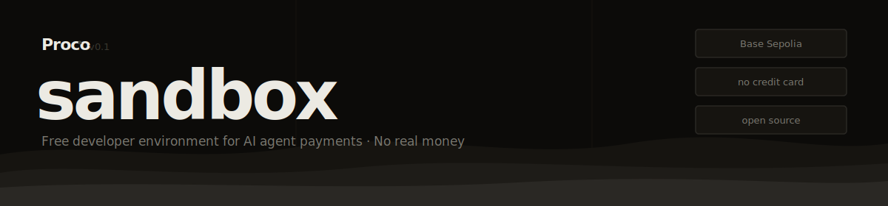

<p align="center">
  
</p>

<p align="center">
  
  
  
  
  <a href="https://github.com/procohq/x402"></a>
</p>

---

Free developer environment for building and testing AI agent payments. Runs on Base Sepolia with testnet USDC. No credit card. No real money.

## What's included

```
src/mock-server.ts         x402-compatible API server (3 paid endpoints)
scripts/basic-payment.ts   create a wallet, make a payment, check balance
scripts/x402-flow.ts       full 402 challenge/response cycle
scripts/policy-enforcement.ts  spending caps, allowlists, per-tx limits
.env.example               sandbox API key + network config
```

## Quickstart

```bash
git clone https://github.com/procohq/lab
cd lab
npm install
cp .env.example .env
```

Get a free sandbox key at [procohq.com/sandbox](https://procohq.com/sandbox) and add it to `.env`:

```
PROCO_API_KEY=sk_sandbox_...
NETWORK=base-sepolia
```

## The mock server

Start a local x402-compatible API server with three priced endpoints:

```bash
npm run server
# Listening on http://localhost:4402
```

| Endpoint | Price | Description |
|----------|-------|-------------|
| `GET /weather` | $0.01 | Weather data |
| `GET /search` | $0.05 | Search results |
| `POST /analyze` | $0.50 | AI analysis |
| `GET /health` | free | Health check |

All endpoints follow the x402 protocol — return `402 Payment Required` until a valid `X-Payment` header is supplied.

## Test scripts

### Basic payment flow

Creates an agent wallet, makes a payment, and checks the updated balance.

```bash
npm run basic
```

```
✓ Wallet created: wallet_abc123  (balance: 10.00 USDC)
✓ Payment sent: $1.00 USDC → api.example.com
✓ Balance updated: 9.00 USDC
```

### Full x402 flow

Demonstrates the complete 402 challenge/response cycle — request → 402 → sign → retry → 200.

```bash
npm run x402
```

```
→ GET /weather
← 402  { amount: 0.01, currency: "USDC", network: "base-sepolia" }
→ POST /v1/payments/sign  (asking Proco to sign payment)
← signed payment proof
→ GET /weather  (X-Payment: <proof>)
← 200  { temp: 22, condition: "clear" }
✓ Payment settled: 0.01 USDC
```

### Policy enforcement

Tests that spending controls are enforced before any transaction reaches the chain.

```bash
npm run policy
```

```
✓ Daily cap enforced      → PolicyViolationError: daily limit exceeded
✓ Vendor allowlist works  → PolicyViolationError: vendor not in allowlist
✓ Per-tx limit works      → PolicyViolationError: amount exceeds per-tx limit
```

## How it works

The sandbox uses real x402 infrastructure on Base Sepolia — the same protocol as production, with testnet funds. Your agent wallet is created via the Proco API, funded automatically with testnet USDC, and can transact immediately.

```
Agent  →  GET /weather
Server  ←  402 + PaymentRequired { amount: $0.01, network: "base-sepolia" }
Agent  →  Proco  POST /v1/payments/sign
Proco  →  Agent  signed X-Payment proof
Agent  →  GET /weather + X-Payment: <proof>
Server  ←  200 + weather data
```

No wallets to create. No faucets to drain. No gas to manage.

## Moving to production

When you're ready to go live, swap your sandbox key for a production key at [procohq.com](https://procohq.com). Same API, same code, real USDC on Base mainnet.

```diff
- PROCO_API_KEY=sk_sandbox_...
+ PROCO_API_KEY=sk_live_...
- NETWORK=base-sepolia
+ NETWORK=base
```

## Related

- [`procohq/pay`](https://github.com/procohq/pay) — Proco pay: payment infrastructure, wallets, and policy enforcement
- [`coinbase/x402`](https://github.com/coinbase/x402) — the x402 open standard
- [procohq.com](https://procohq.com) — production API + wallet dashboard

---

<p align="center">
  <a href="https://procohq.com">procohq.com</a> · MIT · Built by Proco
</p>
